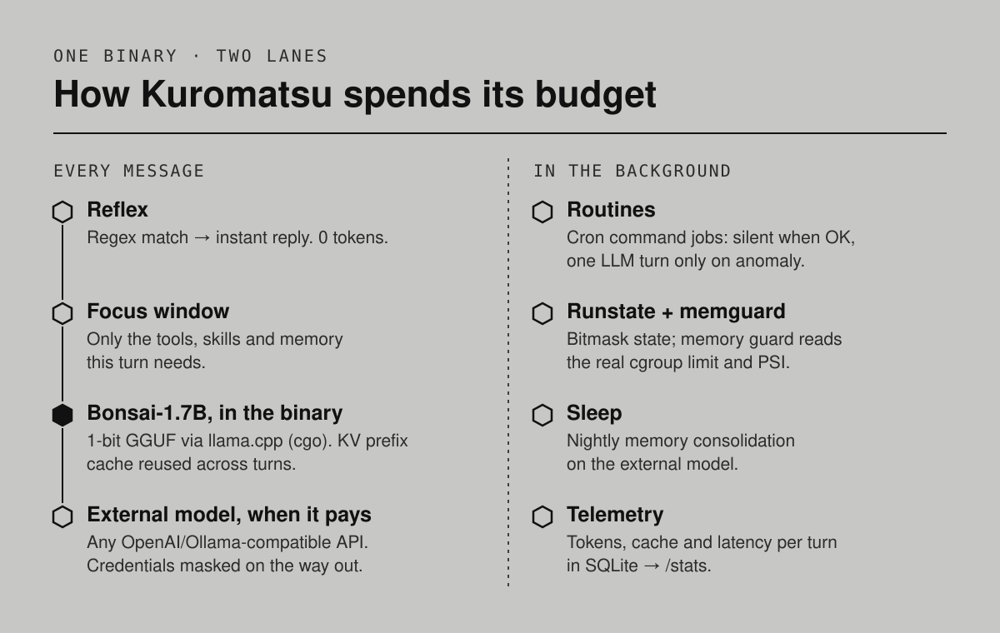

<p align="center">
  
</p>

<p align="center">
  <a href="#quick-start">Quick start</a> ·
  <a href="#how-it-works">How it works</a> ·
  <a href="#configuration">Configuration</a> ·
  <a href="#resumo-em-português">Português</a>
</p>

**Kuromatsu** is a personal AI agent written in Go that lives 24/7 on very small machines. It
ships a 1-bit language model *inside its own binary* (no model server, no API key), talks to you
over Telegram, WhatsApp or its own channel, runs scheduled routines, and keeps a long-term memory —
reaching for a larger external model only when the language actually needs it.

Like the bonsai it is named after (黒松, *black pine*), it is grown by pruning: every token, every
megabyte and every CPU second on a burst-credit VM is treated as a budget.

## Running in production

The reference deployment is a Google Cloud **e2-micro** (shared vCPU, 1 GB RAM) running the
native binary under systemd — no Docker. Numbers measured on that VM:

| | |
| --- | --- |
| Memory ceiling for the whole service | `MemoryMax=900M` (systemd), model loaded |
| Native model | Bonsai-1.7B `Q1_0` GGUF, ~237 MB, in-process via llama.cpp |
| KV prefix-cache reuse on repeated turns | **93%** of prompt tokens served from cache |
| Native generation on the throttled vCPU | ~0.5 tokens/s — slow by design, so heavy language goes external |
| First reply through an external model | 1.9 s (Ollama-compatible endpoint) |
| An idle heartbeat with nothing to do | 0 tokens, 0 model calls |


## How it works

<p align="center">
  
</p>

- **Reflexes** answer pattern-matched messages instantly, without calling any model.
- **Focus windows** route each turn (by origin and content) to a small set of tools, skills and
  memory, so the prompt stays short and cacheable.
- **Native inference** runs Bonsai-1.7B through llama.cpp linked with cgo; the KV cache keeps the
  stable prompt prefix between turns instead of re-reading it.
- **External models** (any OpenAI- or Ollama-compatible API) take the turns that need more
  language; credentials found in outgoing messages are masked and restored locally.
- **Routines** are cron jobs that run plain commands and stay silent when everything is fine; the
  model is woken only to interpret an anomaly, within a daily cap.
- **Runstate + memguard** keep a bitmask of what the agent is doing and protect the 1 GB budget,
  reading the service's real cgroup limit and kernel memory pressure (PSI).
- **Sleep** consolidates long-term memory at night using an external model — never the 1-bit one.
- **Telemetry** records tokens, cache hits and latency per turn in SQLite; `/stats` summarizes it.

## Quick start

**Requirements:** Go 1.25+. For native inference also `cmake`, a C/C++ toolchain and an x86-64
CPU with AVX2.

```bash
git clone --recurse-submodules https://github.com/andre25costa-code/kuromatsu.git
cd kuromatsu

make build                 # pure-Go binary (external models only) -> build/
./build/kuromatsu onboard  # creates ~/.kuromatsu with config and workspace
./build/kuromatsu gateway  # starts the agent and its channels
```

With the in-process model:

```bash
make build-native-x86-64   # links llama.cpp (AVX2) -> build/kuromatsu-native-linux-amd64
scripts/download-model.sh  # fetches Bonsai-1.7B-Q1_0.gguf and checks its SHA-256
```

Talk to it from the terminal without any channel:

```bash
./build/kuromatsu agent -m "What can you do?"
```

## Configuration

Configuration lives in `~/.kuromatsu/config.json`; secrets go in `.security.yml`. A minimal
setup with an external model first and the native model as fallback:

```json
{
  "agents": {
    "defaults": {
      "model_name": "cloud",
      "model_fallbacks": ["bonsai-local"],
      "focus": { "enabled": true }
    }
  },
  "model_list": [
    { "model_name": "cloud", "provider": "ollama", "model": "<model>",
      "api_base": "https://<your-endpoint>/v1" },
    { "model_name": "bonsai-local", "provider": "native", "model": "Bonsai-1.7B-Q1_0",
      "tool_schema_transform": "compact" }
  ]
}
```

Channels: **Telegram**, **WhatsApp** and the built-in **Pico** channel. Always restrict who can
talk to the agent — a channel with an empty `allow_from` accepts **anyone**:

```json
"channel_list": {
  "telegram": { "enabled": true, "type": "telegram", "allow_from": ["<your-telegram-user-id>"] }
}
```

Shell commands requested from a chat are off by default; enable them only for channels you
trust with `"tools": { "exec": { "allow_remote": true } }`.

Scheduling:
`kuromatsu cron add --command '…' --quiet` for deterministic routines, `HEARTBEAT.md` for
periodic tasks that need judgment. The workspace (`AGENT.md`, `SOUL.md`, `USER.md`,
`HEARTBEAT.md`, `memory/`) defines who the agent is; the repository ships a neutral template.

The full reference — every config key, channel, tool, schedule and the sleep mode — is the
`kuromatsu-docs` skill the agent itself reads: [`workspace/skills/kuromatsu-docs`](./workspace/skills/kuromatsu-docs/SKILL.md).

## Deployment

The production path is a native binary under systemd on Linux x86-64:
[`deploy/systemd/`](./deploy/systemd) holds the unit (with `MemoryMax`) and
[`deploy/`](./deploy) the sysctl and nftables tuning. Copy the binary, install the unit and
start it — no container runtime needed. Docker files remain in [`docker/`](./docker) for local use.

## Limits

- Native generation is slow on shared CPUs; Kuromatsu is built to need the native model rarely,
  not to make it fast.
- The native build targets x86-64 with AVX2; other platforms use the pure-Go build with external
  models.
- There is no built-in embeddings model: semantic memory search needs an external embeddings
  endpoint.

## Resumo em português

O **Kuromatsu** é um agente pessoal de IA em Go que roda 24/7 em máquinas pequenas — a referência
é uma VM e2-micro do Google Cloud com 1 GB de RAM. Ele carrega um modelo de linguagem de 1 bit
(Bonsai-1.7B) **dentro do próprio binário**, conversa por Telegram, WhatsApp ou canal próprio,
executa rotinas agendadas que só acordam o modelo quando algo sai do normal, e consolida a
memória de longo prazo à noite usando um modelo externo. Cada token, megabyte e segundo de CPU é
tratado como orçamento.

## Credits

Kuromatsu started as a fork of [PicoClaw](https://github.com/sipeed/picoclaw) (MIT). Native
inference uses [llama.cpp](https://github.com/ggml-org/llama.cpp) through the
[PrismML-Eng fork](https://github.com/PrismML-Eng/llama.cpp) and the
[Bonsai-1.7B](https://huggingface.co/prism-ml/Bonsai-1.7B-gguf) model by prism-ml.

## License

[MIT](./LICENSE).
