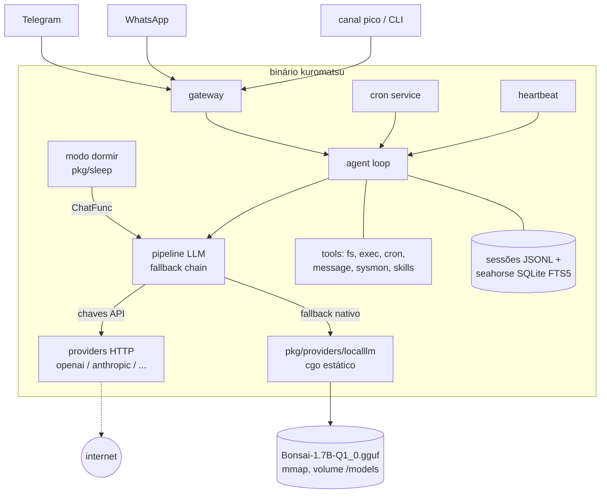

# S13 — Arquitetura geral

Um único binário Go (`kuromatsu`). A inferência local é código C/C++ do fork prism
linkado **estaticamente dentro do binário** (cgo, build tag `nativellm`); não há
processo nem porta de modelo.

## Relações-chave

| De → Para | Contrato |
|---|---|
| pipeline → providers | interface `LLMProvider.Chat(messages, tools, model, options)`; candidatos resolvidos pela fallback chain existente |
| factory → localllm | `case "native"` em `CreateProviderFromConfig`; opções vindas de `ModelConfig.ExtraBody` |
| localllm → llama.cpp | funções C de `include/llama.h`; libs `.a` produzidas pelo cmake do submodule |
| sleep → pipeline | `ChatFunc` construída sobre `resolveModelCandidates` + `ExecuteCandidate` (o "inconsciente" é qualquer modelo da model_list) |
| sleep ← evolution | reusa `evolution.ColdPathRunner` (single-flight + coalescing) |
| config → chain | `ApplyNativeFallback` injeta `bonsai-local` (padrão sem chaves; último fallback com chaves) |

## Sistemas externos

- **Provedores LLM via HTTP** — opcionais, só com chave em `config.json`/`.security.yml`.
- **Telegram/WhatsApp** — canais de entrada/saída.
- **GitHub (PrismML-Eng/llama.cpp)** — origem do submodule pinado.
- **Fonte do GGUF** (S25, TBD) — usada apenas pelo script de download; runtime nunca baixa nada.
