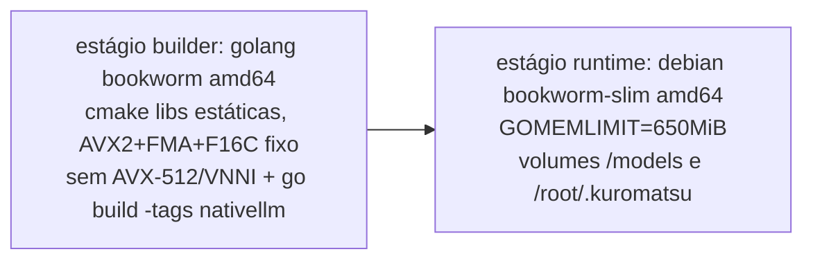

# S32 — Arquitetura de deploy

## Ambientes

> **Correção 2026-09-11 (ADR-012)**: a VM Oracle real é **x86_64** (AMD EPYC 7551
> "Naples"/Zen1), não ARM64 — o André não conseguiu disponibilidade da shape A1 e criou
> a VM com a shape padrão x86 (por isso só 1 GB de RAM; a A1 chegaria a 6 GB). Isso na
> prática **simplifica** o pipeline: build host, target de deploy e (provavelmente) a
> máquina de dev são todos amd64 — sem cross-compilação, sem QEMU.

> **Atualização 2026-09-11 (ADR-013, plano `demetrius`, `proposed`)**: a Oracle acima
> ficou **tecnicamente pronta mas inutilizável em produção** — `steal` 75% medido
> (CPU real ~25%). O alvo de produção/inferência passa a ser a VM Google `demetrius`
> (`e2-micro`, Always Free do GCP), rodando o binário **direto sob systemd, sem
> Docker em runtime**; a Oracle vira alvo de **backup** cross-cloud (S33). A migração
> real já está em andamento, com resultados parciais medidos
> (`.claude/team/research/g0-medicao-real.md`) — não é só desenho.

| Ambiente | Papel | Build/operação |
|---|---|---|
| Windows 11 (dev) | Código Go puro, testes de `localllm` sem cgo | `make build` / `go test` |
| GitHub Actions (`ubuntu-latest`, amd64) | Compila a imagem nativa inteira **e** publica os binários crus extraídos dela (ADR-013) | `.github/workflows/build-native-image.yml` (manual) |
| WSL/Docker local (dev, amd64) | Fallback opcional se/quando o host de dev tiver RAM sobrando | `make docker-build-native` |
| **`demetrius` (Google `e2-micro`, prod/inferência)** | Executa o binário `kuromatsu` **direto sob systemd** — nunca builda, nunca roda Docker em runtime | `scp` do binário cru + `systemctl restart` (`scripts/deploy-demetrius.sh`, referenciado pelo plano, ainda não versionado no repo) |
| Oracle `VM.Standard.E2.1.Micro` (**backup**, não roda mais inferência) | Recebe `rsync` cross-cloud do backup noturno gerado na `demetrius` (S33) — `steal` 75% a torna inviável para inferência | `rsync`/SSH (push, iniciado pela `demetrius`) |

A Oracle não tem RAM nem toolchain C++ para compilar nada (C1/S06). O host de dev
também não tem folga segura (medido: ~8 GB físicos, teto que já derrubou a VM WSL no
E5) — por isso o build roda no runner amd64 nativo do GitHub Actions. A imagem
pronta continua sendo o artefato de build determinístico do CI; o que efetivamente
viaja para a `demetrius` agora são os **binários crus** extraídos dela (ver seção
"Deploy binário direto" abaixo) — a Oracle, quando ainda era alvo de inferência,
recebia a imagem via `docker load`; esse caminho fica histórico junto com a nota
ARM64 abaixo, já que a Oracle não roda mais o serviço.

## Pipeline de build da imagem nativa (`docker/Dockerfile.native`)

- Como build host e target de deploy são a mesma arquitetura (amd64), **o build é
  nativo em ambos os estágios, sem cross-toolchain e sem qualquer emulação QEMU**
  (ADR-012 — corrige a suposição inicial de ARM64/ADR-011, que exigia um dos dois).
  Isso resolve de vez os travamentos por falta de memória sofridos no E5: o runner do
  GitHub Actions tem RAM de sobra (16 GB) e não compete com nada mais.
- **CPU pinada, não auto-detectada**: `GGML_NATIVE=OFF` com `AVX2+FMA+F16C` fixos e
  `AVX-512`/`AVX-VNNI` explicitamente desligados — o runner do GitHub pode ter uma CPU
  mais nova (com AVX-512) que a Oracle (Zen1, EPYC 7551) não tem; sem essa pinagem o
  binário compilaria com instruções que dão SIGILL na VM real (mesmo princípio do
  `armv8.2-a+dotprod+fp16` que já era usado na hipótese ARM64 — ver S18, R3).
- Estágio builder é cacheado pelo conteúdo do submodule — mudar código Go não
  recompila C++.
- O GGUF **nunca** entra na imagem: volume `../models:/models:ro` (C2, BR-003).
- Compose: `mem_limit: 900m`, `memswap_limit: 900m`; sem rede externa `llama-net`
  (a inferência é in-process — nunca existiu no compose nativo).
- **Entrega da imagem — caminho histórico (Oracle como alvo de inferência,
  superseded por ADR-013)**: `docker save kuromatsu:native-amd64 | gzip >
  kuromatsu-native-amd64.tar.gz`, `scp` para o servidor, `docker load` lá — sem
  depender de um registry. Continua válido como forma de *rodar a imagem localmente*
  (dev/WSL), mas não é mais como o binário chega à VM de produção (ver seção
  seguinte).
- Rollback (caminho histórico): manter o `.tar.gz` anterior; `docker load` dele +
  `docker compose up` volta à versão anterior. O modelo e o estado (`docker/data`)
  são volumes, não são afetados.

## Deploy binário direto na `demetrius` (systemd, ADR-013 `proposed`) — caminho primário atual

A imagem `kuromatsu:native-amd64` continua sendo o artefato de build determinístico
do CI, mas deixa de ser o veículo de deploy: o `.github/workflows/build-native-image.yml`
passa a publicar **também** os binários crus extraídos da imagem
(`kuromatsu-native-linux-amd64`, `nativebench-linux-amd64` — AC-020-3), que é o que
efetivamente viaja para a `demetrius` via `scp` + `systemctl restart`
(`scripts/deploy-demetrius.sh`, referenciado pelo plano; ainda não versionado no
repo — item de execução do Trilho D, não deste capítulo). Sem Docker em runtime: o
Docker já instalado na VM (29.8) fica **desativado, não removido**
(`docker.socket docker containerd`), liberando ~51 MB de RSS que `dockerd+containerd`
ocupavam — rollback trivial (`systemctl enable --now docker`, AC-020-5).

Artefatos já versionados no repo (não é só desenho — a migração real está em
andamento, com resultados parciais medidos em
`.claude/team/research/g0-medicao-real.md`):

| Artefato | Caminho | Papel |
|---|---|---|
| Unit do serviço | `deploy/systemd/kuromatsu.service` | `Type=simple` por ora (`Type=notify`+`WatchdogSec` quando o `sd_notify` do runstate — S09/S34 — estiver pronto); `MemoryMax=850M`, `CPUWeight=1000`, `Nice=-5`, `OOMScoreAdjust=-500`, enrijecimento completo (S27) |
| Timer/service de backup | `deploy/systemd/kuromatsu-backup.{timer,service}` | Backup noturno cross-cloud para a Oracle — ver S33 |
| THP → `madvise` | `deploy/systemd/kuromatsu-thp-madvise.service` | Evita que Transparent Huge Pages `always` infle o RSS em ~1 GB de RAM |
| Sysctl | `deploy/sysctl/99-z-kuromatsu.conf` | `vm.swappiness=100` (zram já ativo — preferir comprimir heap ocioso a descartar as páginas mmap do modelo), `vm.page-cluster=0`, `vm.vfs_cache_pressure=50`, `vm.overcommit_memory=1`. Nome escolhido para ordenar **depois** de qualquer `99-*.conf` pré-existente na VM (o último vence por chave) — não edita/apaga tuning antigo |
| nftables | `deploy/nftables/ssh-ratelimit.nft` | Substitui o `fail2ban` (rate-limit nativo na porta 22) — detalhe e gate de verificação em S27 |

**Trim do SO** (Trilho 0, decidido): `google-cloud-ops-agent*`, `google-osconfig-agent`,
`exim4`, `rsyslog`, `haveged` desativados (não purgados — rollback em 1 semana);
**mantidos**: `google-guest-agent` (chaves SSH), `unattended-upgrades`, `chrony`.
Aceite (AC-020-1): `MemAvailable` idle ≥650 MB — **medido nesta sessão: 696 MB**
(vs. 466 MB antes do trim), acima da meta.

**Layout na VM**: usuário de sistema `kuromatsu`; binários em
`/opt/kuromatsu/bin/{kuromatsu,nativebench}`; `KUROMATSU_HOME=/var/lib/kuromatsu`
(config, workspace, sessões, modelo em `models/Bonsai-1.7B-Q1_0.gguf` — mesmo
arquivo movido de `~/stacks-agent/`, SHA256 confirmado idêntico ao de
`scripts/download-model.sh` nesta sessão).

## Nota histórica: caminho ARM64 (ADR-011, superseded)

O design original (E7, antes da correção acima) assumia a VM Oracle como ARM64
(Ampere A1) e construiu um pipeline de cross-compilação (`aarch64-linux-gnu-gcc`) +
runner arm64 nativo do GitHub (`ubuntu-24.04-arm`), validado de ponta a ponta com
sucesso (build real de 3m05s, imagem funcional). Esse caminho continua no repositório
(`llama-lib-arm64`/`build-native-arm64` no Makefile) como suporte a um possível deploy
ARM64 futuro (ex.: Raspberry Pi, ou se o André conseguir a shape A1 depois) — só deixou
de ser o caminho *primário* para a Oracle atual. Ver ADR-011 e ADR-012.

## Migrações em runtime

Ver **S22** (Migração e transformação de dados) — única migração é o home dir
`~/.picoclaw` → `~/.kuromatsu`, decidida em ADR-005.

## CI herdada

Os workflows de `.github/workflows` (build, release, goreleaser, docker) referenciam
nomes e binários do PicoClaw — serão ajustados/aparados durante E2/E3 junto com a poda
e o rebrand. Build nativo fica fora da CI num primeiro momento (Docker-only) —
`build-native-image.yml` (o workflow do binário nativo em si) é o que ganha o passo
extra de publicar binários crus (ver seção "Deploy binário direto" acima).

## Cross-referências

- **Segurança do enrijecimento systemd/nftables**: S27.
- **Motor de estados que fará o gating do backup/heartbeat na `demetrius`**: S09.
- **Backup cross-cloud para a Oracle**: S33 (resolve Q2/S06).
- **Metas de RAM/tok/s medidas na `demetrius`**: S29 (NFR-002/006-009), S39 (baseline).
- **Decisão de arquitetura do novo alvo**: ADR-013.
