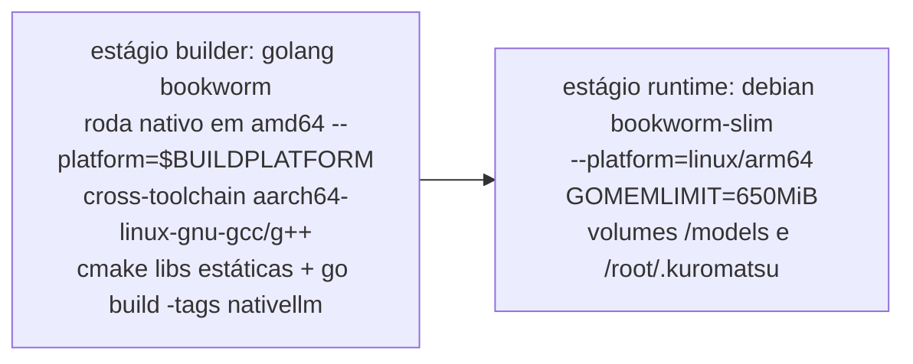

# S32 — Arquitetura de deploy

## Ambientes

| Ambiente | Papel | Build |
|---|---|---|
| Windows 11 (dev) | Código Go puro, testes de `localllm` sem cgo | `make build` / `go test` |
| GitHub Actions (`ubuntu-24.04-arm`) | **Caminho principal**: compila a imagem nativa inteira em arm64 real | `.github/workflows/build-native-image.yml` (manual) |
| WSL/Docker local (dev, x86_64) | Fallback opcional se/quando o host de dev tiver RAM sobrando | `make docker-build-native` |
| Oracle ARM64 1 GB (prod) | Só executa a imagem já pronta — nunca builda | `docker load` + `docker compose up` |

A Oracle não tem RAM nem toolchain C++ para compilar nada (C1/S06). O host de dev
também não tem folga segura (medido: ~8 GB físicos, teto que já derrubou a VM WSL no
E5) — por isso o build roda no runner arm64 nativo do GitHub Actions (ADR-011), e só a
imagem pronta (baixada como artefato do workflow) viaja para a Oracle.

## Pipeline de build da imagem nativa (`docker/Dockerfile.native`)

- **Todo o trabalho pesado (cmake/g++ da ggml/llama.cpp, `go build`) roda nativamente
  no host amd64**, via cross-toolchain `aarch64-linux-gnu-gcc`/`g++` — nunca sob
  emulação QEMU (ADR-011). Isso evita repetir os travamentos por falta de memória já
  sofridos no E5 compilando nativamente (que seriam piores sob emulação).
- Só o estágio final (`--platform=linux/arm64`, `apt-get install` de pacotes prontos)
  roda emulado quando necessário — leve, E/S-bound, sem compilação.
- Estágio builder é cacheado pelo conteúdo do submodule — mudar código Go não
  recompila C++.
- O GGUF **nunca** entra na imagem: volume `../models:/models:ro` (C2, BR-003).
- Compose: `mem_limit: 900m`, `memswap_limit: 900m`; sem rede externa `llama-net`
  (a inferência é in-process — nunca existiu no compose nativo).
- **Entrega da imagem à Oracle**: `docker save kuromatsu:native-arm64 | gzip >
  kuromatsu-native-arm64.tar.gz`, `scp` para o servidor, `docker load` lá — sem
  depender de um registry (ADR-011). Publicar num registry fica como opção futura.
- Rollback: manter o `.tar.gz` anterior; `docker load` dele + `docker compose up`
  volta à versão anterior. O modelo e o estado (`docker/data`) são volumes, não são
  afetados.

## Migrações em runtime

Única migração: home dir `~/.picoclaw` → `~/.kuromatsu`, por **leitura in-place**
(sem cópia; ADR-005). Migração física fica para um comando explícito futuro.

## CI herdada

Os workflows de `.github/workflows` (build, release, goreleaser, docker) referenciam
nomes e binários do PicoClaw — serão ajustados/aparados durante E2/E3 junto com a poda
e o rebrand. Build nativo fica fora da CI num primeiro momento (Docker-only).
