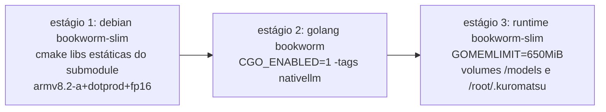

# S32 — Arquitetura de deploy

## Ambientes

| Ambiente | Papel | Build |
|---|---|---|
| Windows 11 (dev) | Código Go puro, testes de `localllm` sem cgo | `make build` / `go test` |
| WSL/Docker local (dev) | Validar engine cgo e imagem nativa | `make build-native` / `docker buildx` |
| Oracle ARM64 1 GB (prod) | Agente 24/7 em Docker | imagem `kuromatsu:native` (linux/arm64) |

## Pipeline de build da imagem nativa (`docker/Dockerfile.native`)

- Estágio 1 é cacheado pelo conteúdo do submodule — mudar código Go não recompila C++.
- O GGUF **nunca** entra na imagem: volume `../models:/models:ro` (C2, BR-003).
- Compose: `mem_limit: 900m`, `memswap_limit: 900m`; sem rede externa `llama-net`
  (a inferência é in-process — remoção no E7).
- Rollback: `docker compose` volta à tag de imagem anterior; o modelo e o estado
  (`docker/data`) são volumes, não são afetados.

## Migrações em runtime

Única migração: home dir `~/.picoclaw` → `~/.kuromatsu`, por **leitura in-place**
(sem cópia; ADR-005). Migração física fica para um comando explícito futuro.

## CI herdada

Os workflows de `.github/workflows` (build, release, goreleaser, docker) referenciam
nomes e binários do PicoClaw — serão ajustados/aparados durante E2/E3 junto com a poda
e o rebrand. Build nativo fica fora da CI num primeiro momento (Docker-only).
