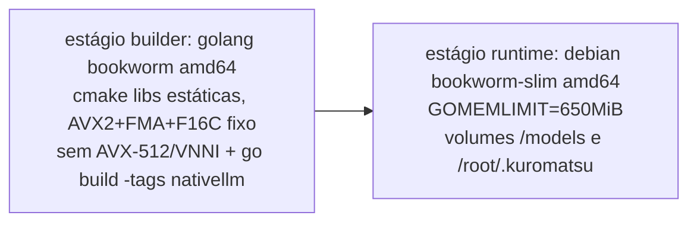

# S32 — Arquitetura de deploy

## Ambientes

> **Correção 2026-09-11 (ADR-012)**: a VM Oracle real é **x86_64** (AMD EPYC 7551
> "Naples"/Zen1), não ARM64 — o André não conseguiu disponibilidade da shape A1 e criou
> a VM com a shape padrão x86 (por isso só 1 GB de RAM; a A1 chegaria a 6 GB). Isso na
> prática **simplifica** o pipeline: build host, target de deploy e (provavelmente) a
> máquina de dev são todos amd64 — sem cross-compilação, sem QEMU.

| Ambiente | Papel | Build |
|---|---|---|
| Windows 11 (dev) | Código Go puro, testes de `localllm` sem cgo | `make build` / `go test` |
| GitHub Actions (`ubuntu-latest`, amd64) | **Caminho principal**: compila a imagem nativa inteira, nativamente | `.github/workflows/build-native-image.yml` (manual) |
| WSL/Docker local (dev, amd64) | Fallback opcional se/quando o host de dev tiver RAM sobrando | `make docker-build-native` |
| Oracle x86_64 1 GB (prod) | Só executa a imagem já pronta — nunca builda | `docker load` + `docker compose up` |

A Oracle não tem RAM nem toolchain C++ para compilar nada (C1/S06). O host de dev
também não tem folga segura (medido: ~8 GB físicos, teto que já derrubou a VM WSL no
E5) — por isso o build roda no runner amd64 nativo do GitHub Actions, e só a imagem
pronta (baixada como artefato do workflow) viaja para a Oracle.

## Pipeline de build da imagem nativa (`docker/Dockerfile.native`)

- Como build host e target de deploy são a mesma arquitetura (amd64), **o build é
  nativo em ambos os estágios, sem cross-toolchain e sem qualquer emulação QEMU**
  (ADR-012 — corrige a suposição inicial de ARM64/ADR-011, que exigia um dos dois).
  Isso resolve de vez os travamentos por falta de memória sofridos no E5: o runner do
  GitHub Actions tem RAM de sobra (16 GB) e não compete com nada mais.
- **CPU pinada, não auto-detectada**: `GGML_NATIVE=OFF` com `AVX2+FMA+F16C` fixos e
  `AVX-512`/`AVX-VNNI` explicitamente desligados — o runner do GitHub pode ter uma CPU
  mais nova (com AVX-512) que a Oracle (Zen1, EPYC 7551) não tem; sem essa pinagem o
  binário compilaria com instruções que dão SIGILL na VM real (mesmo princípio do
  `armv8.2-a+dotprod+fp16` que já era usado na hipótese ARM64 — ver S18, R3).
- Estágio builder é cacheado pelo conteúdo do submodule — mudar código Go não
  recompila C++.
- O GGUF **nunca** entra na imagem: volume `../models:/models:ro` (C2, BR-003).
- Compose: `mem_limit: 900m`, `memswap_limit: 900m`; sem rede externa `llama-net`
  (a inferência é in-process — nunca existiu no compose nativo).
- **Entrega da imagem à Oracle**: `docker save kuromatsu:native-amd64 | gzip >
  kuromatsu-native-amd64.tar.gz`, `scp` para o servidor, `docker load` lá — sem
  depender de um registry. Publicar num registry fica como opção futura.
- Rollback: manter o `.tar.gz` anterior; `docker load` dele + `docker compose up`
  volta à versão anterior. O modelo e o estado (`docker/data`) são volumes, não são
  afetados.

## Nota histórica: caminho ARM64 (ADR-011, superseded)

O design original (E7, antes da correção acima) assumia a VM Oracle como ARM64
(Ampere A1) e construiu um pipeline de cross-compilação (`aarch64-linux-gnu-gcc`) +
runner arm64 nativo do GitHub (`ubuntu-24.04-arm`), validado de ponta a ponta com
sucesso (build real de 3m05s, imagem funcional). Esse caminho continua no repositório
(`llama-lib-arm64`/`build-native-arm64` no Makefile) como suporte a um possível deploy
ARM64 futuro (ex.: Raspberry Pi, ou se o André conseguir a shape A1 depois) — só deixou
de ser o caminho *primário* para a Oracle atual. Ver ADR-011 e ADR-012.

## Migrações em runtime

Única migração: home dir `~/.picoclaw` → `~/.kuromatsu`, por **leitura in-place**
(sem cópia; ADR-005). Migração física fica para um comando explícito futuro.

## CI herdada

Os workflows de `.github/workflows` (build, release, goreleaser, docker) referenciam
nomes e binários do PicoClaw — serão ajustados/aparados durante E2/E3 junto com a poda
e o rebrand. Build nativo fica fora da CI num primeiro momento (Docker-only).
