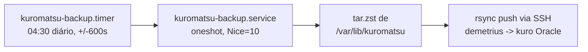

# S33 — Backup

> **Status**: `confirmed` — ADR-013 (`accepted`), plano `demetrius`. Este item estava
> `missing` (Q2 em S06: "política de backup da VM Oracle — snapshot? rsync do
> `docker/data`?" — sem decisão). **Resolvida** com a mudança de papel da Oracle: ela
> deixa de ser a VM de produção (`steal` 75%, inviável para inferência — ADR-013) e
> passa a ser o **alvo de backup** cross-cloud da `demetrius`, aproveitando uma
> capacidade Always Free que já existia mas estava ociosa para este fim.

## Mecanismo

| Peça | Onde vive | Estado |
|---|---|---|
| Timer | `deploy/systemd/kuromatsu-backup.timer` | Versionado no repo. `OnCalendar=*-*-* 04:30:00`, `RandomizedDelaySec=600`, `Persistent=true` (roda no boot se perdeu a janela) |
| Service | `deploy/systemd/kuromatsu-backup.service` | Versionado no repo. `Type=oneshot`, `Nice=10`, `IOSchedulingClass=best-effort` (não disputa I/O com a inferência) |
| Script | `/opt/kuromatsu/bin/backup-to-kuro.sh` | **Referenciado pela unit, ainda não criado** — o `ExecStart` da unit já aponta para ele; a implementação do `tar.zst` + `rsync` em si é passo de execução do Trilho D, não deste capítulo (spec, não código) |
| Destino | `kuro` (Oracle `VM.Standard.E2.1.Micro`) | Push via SSH, cross-cloud, custo zero (Always Free em ambos os lados) |

O que é copiado: todo `/var/lib/kuromatsu` (`KUROMATSU_HOME`) — config, workspace,
sessões, memória (`MEMORY.md`, seahorse), telemetria. Nenhum segredo novo além do
que já vive em `.security.yml` hoje (S27 — sem mudança de superfície de dados, só de
destino do backup).

## Por que o `kuro` (Oracle) e não outro destino

- **Já é Always Free** — sem custo adicional, diferente de contratar armazenamento
  novo.
- **Já não roda inferência** (ADR-013: `steal` 75% a torna inviável para isso) — a
  VM não fica ociosa, passa a ter um papel real.
- **Cross-cloud de verdade**: um incidente que derrube a conta/região do GCP não
  afeta a Oracle (provedores e contas diferentes) — redundância genuína, não
  cosmética.
- Complementar: snapshot semanal do disco da própria `demetrius` no GCP (Always
  Free) cobre o caso "perdi a VM de produção inteira" sem depender do `rsync` ter
  rodado na noite anterior.

## Gating por `runstate` — gap aberto até C1

A unit `kuromatsu-backup.service` já traz, no próprio `[Unit]`, o comentário:

> `TODO(runstate/C1): condicionar a execucao ao runstate == Idle (ADR-016) antes de
> habilitar o timer em producao — por ora, roda no horario e aceita colidir com uma
> inferencia em andamento (raro na janela 04:30, mas nao gated ainda).`

Ou seja: **hoje o timer não verifica `runstate`** — ele roda no horário
independentemente de haver inferência em curso (só o `Nice=10`/I/O `best-effort`
reduz o impacto, não o elimina). AC-020-6 (S11/FR-020) descreve o comportamento
**alvo** (gated por `Idle`) — o gating real depende do `runstate` (C1) estar
publicando estado, que ainda não foi implementado nesta VM. Até lá, o risco aceito é
uma colisão pontual às 04:30 com uma inferência rara nesse horário (mitigado, não
eliminado).

## Retenção e restore — gaps abertos (TBD)

| Questão | Decide quem | Status |
|---|---|---|
| Quantas cópias manter no `kuro` (retenção por dia/semana) — apagar antigas ou acumular indefinidamente no disco de 30 GB da Oracle? | André | `tbd` — não decidido; sem risco imediato (Oracle tem 24 GB livres, ver levantamento do plano) |
| Procedimento de restore (como reconstruir `/var/lib/kuromatsu` a partir de um `.tar.zst` no `kuro` se a `demetrius` for perdida) | André | `tbd` — **gap aberto explícito**, citado também em S17 ("sem reconciliação de um backup parcial... o gap de restore procedure"). Nenhum runbook de restore foi escrito ou testado ainda |
| O que acontece se o `rsync` falhar no meio (rede instável entre nuvens) | — | Comportamento aceito, sem lógica nova: o próximo timer (noite seguinte) tenta de novo com um `tar.zst` novo; não há reconciliação de um backup parcial (S17) |

## Cross-referências

- **Questão de origem resolvida por este capítulo**: Q2 em S06.
- **Gating por `Idle` (quando implementado)**: S09 (estados), S17 (semântica de
  falha/skip).
- **Decisão de arquitetura** (Oracle como backup, motivo da mudança de papel):
  ADR-013. **Motor de estados que fará o gating real**: ADR-016.
- **Contrato de aceite**: AC-020-6 (S11/FR-020).
